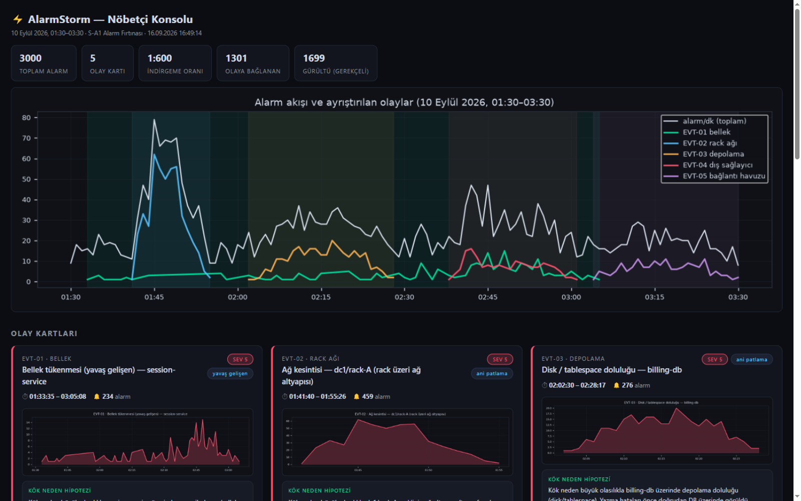

# achillies — AlarmStorm: Alarm Fırtınası Korelasyon Motoru

> **S-A1 "Alarm Fırtınası"** çözümü · AO Hackathon 2026 · 16 Eylül 2026
> 3.000 alarmlık seli, nöbetçi mühendisin okuyup harekete geçebileceği **5 olay kartına** indirger (1:600 indirgeme oranı) — her kartta gerekçeli kök neden hipotezi, kanıt maddeleri, karşı olasılıklar, etkilenen servisler ve sahip + durum bilgili ilk aksiyon.



## 1. Proje Adı ve Tek Cümlelik Özet

**AlarmStorm** — İki saatlik pencerede 3.000 alarmı, zaman-topoloji-nedensellik korelasyonu ile en fazla 15 olay kartına indirgeyen ve her indirgeme kararını denetlenebilir gerekçelerle açıklayan (XAI) nöbetçi konsolu.

## 2. Çözdüğümüz Problem

Nöbetçi mühendisin derdi alarm sayısı değil, alarmlar arasındaki **neden-sonuç ilişkisinin görünmez olması**dır: hangi alarm kök neden, hangisi türev etki, hangisi alakasız gürültü belli değildir. Bizden istenen: akışı birkaç karara indirgemek ve **bu indirgemenin gerekçesini göstermek**. Veri: 3.000 alarm · 27 servis · 56 sunucu · 32 bağımlılık kaydı · 2 saat (01:30–03:30).

## 3. Çözümümüzün Nasıl Çalıştığı

Beş aşamalı, tamamen deterministik boru hattı (`src/alarmstorm/`):

1. **Anomali hücreleri** — Her `(servis, alarm_tipi, 5 dk)` hücresi, o alarm tipinin global taban çizgisiyle karşılaştırılır; hücre sayısı `max(3, 8×taban)` eşiğini aşarsa hücre "yapısal sinyal" damgalanır. Ağ alarmları için rack bazlı ikinci bir kontrol eklenir. Amaç: alarm tipinin kendisi olay demek değildir (tipler olaylar arasında paylaşılır); **olay, tipin beklenenin üzerinde yoğunlaşmasıdır**.
2. **Tohum kümeleme** — Yapısal sinyaller birlik-find (union-find) ile kümelenir. İki sinyal ancak şularsa bağlanır: aynı servis (≤2 dilim), **blame kenarı** (`timeout/conn_refused/ext_*` mesajları hangi servisin çağrılıp başarısız olduğunu İSİMLE yazdırır — veriden bedava nedensellik kenarları), bağımlılık grafiğinde ≤1 hop komşuluk, veya yalnızca ağ alarmları için aynı rack. "Yavaş gelişen" olaylar, aynı `(servis, kaynak tipi)` anomali hücrelerinin uzun soluklu sürmesiyle ayrıca tohumlanır (ör. session-service bellek sızıntısı).
3. **Attach (kar topu, frenli)** — Dosyadaki HER alarm, zaman penceresi çakışan olaylara teklif edilir; en yakın nedensel eve gider (blame eşleşmesi > aynı servis > graf mesafesi; eşitlikte "o an en sıcak" olay kazanır). Pencere yalnız güçlü kanıtla (blame/anomal eşleşmesi) büyür — gürültü pencereyi şişiremez.
4. **Kök neden skorlaması** — Her olayın adayları beş sinyalle sıralanır: blame sayısı, sert hata işaretçileri (kök-tipli ağırlıklı), **grafın açıklama gücü** (bozulduğunda kaç etkilenen servis etkilenir), erkenlik, kritiklik. DB katmanı indirimi: servis kendi DB'si kırıyorken servisin DB-katmanı hataları yarıya iner (türev sayılır). Ağ işaretçileri tek rack'e yoğunlaşmışsa kök **rack'in kendisi** olur (top-of-rank switch).
5. **Gürültü denetimi** — Olaya bağlanmayan HER alarm kaydı, açık gerekçeyle (zaman çakışması yok / anomali eşiği altında / topolojik bağ yok) elenir. Hiçbir alarm sessizce kaybolmaz.

**Sonuç (bu veriyle):** 5 olay kartı — dc1/rack-A ağ kesintisi (718 alarm), billing-db disk/tablespace doluluğu (400), payment-provider-gw dış sağlayıcı degradasyonu (245), session-service bellek sızıntısı — yavaş gelişen (611), subscriber-db havuz tükenmesi (407). 619 alarm gerekçeli gürültü. Zaman içinde çakışan iki bağımsız olay (session sızıntısı ↔ ödeme sağlayıcı) **bilinçli olarak ayrı tutuldu**.

## 4. Kurulum Adımları

```bash
git clone https://github.com/Rollingzzzzz/ao-hackathon-2026-achillies.git
cd ao-hackathon-2026-achillies
python -m venv .venv
.venv\Scripts\activate            # Windows (Linux/macOS: source .venv/bin/activate)
pip install -r requirements.txt
# Veri paketini data/package/katilimci_paketi/ altına açın (repoya girmez, .gitignore'lıdır)
```

Ön koşullar: Python 3.11+ (geliştirme 3.12.10 ile yapıldı), veri paketi (`alarms.csv`, `service_dependencies.csv`, `host_inventory.csv`).

## 5. Çalıştırma Komutu

```bash
# 1) Boru hattını çalıştır: olay kartları + grafikler + dashboard üretilir (out/)
python run.py --debug

# 2) Demo sunucusunu başlat (aksiyon yaşam döngüsü canlı)
python serve.py
# → http://localhost:8787 açın: kartlar, hipotezler, gürültü denetimi;
#   kart üzerinde "İşleme Al / Kapat" ile aksiyon durumu canlı değişir ve geçmişi kalır.
```

Tüm eşikler CLI'dan ayarlanabilir: `--slice-min --min-cell --k-cell --min-seed-size --attach-dist --max-events ...` (bkz. `python run.py --help`).

## 6. Kullanılan AI Araçları ve Model Sürümleri

_Zorunlu beyan:_

| Araç | Sürüm | Kullanım Alanı |
|------|-------|----------------|
| ZCode (AI kod asistanı ajanı) | GLM-5.3 | Veri keşfi ve profil analizi, korelasyon algoritması tasarımı, kod yazımı, hata ayıklama, kart metinleri; insan tüm kararlarda kabul makamı |
| Browser otomasyonu (ZCode built-in) | — | Dashboard görsel doğrulaması ve `demo/` ekran görüntüleri |

Ayrıntılı AI iş bölümü: [`AI_JURI.md`](AI_JURI.md) · kayda değer istemler: [`prompts/`](prompts/)

## 7. MCP Sunucu Listesi

Kullanılmadı (yerel dosya işleme; dış servis çağrısı yok).

## 8. Entegre Edilen API'ler

Yok — tamamen yerel/çevrimdışı çalışır.

## 9. Ekran Görüntüleri

- [`demo/dashboard_top.png`](demo/dashboard_top.png) — konsol üst bölümü: istatistik çipleri, global zaman çizelgesi, olay bantları
- [`demo/dashboard_full.png`](demo/dashboard_full.png) — tam sayfa: 5 olay kartı (hipotez + kanıt + karşı olasılık + aksiyon) ve gürültü denetimi
- [`out/charts/*.png`](out/charts/) — olay bazlı zaman çizelgeleri (boru hattı çıktısı)

## 10. Kullanılan Kütüphaneler

| Kütüphane | Sürüm | Amaç |
|-----------|-------|------|
| pandas | 3.0.5 | veri işleme, gruplama |
| matplotlib | 3.11.2 | zaman çizelgesi grafikleri |
| (standart kütüphane) | — | HTTP demo sunucusu, JSON I/O, birlik-find |

Tam donmuş sürümler: [`requirements.txt`](requirements.txt)

## 11. Deploy URL ve Bilinen Sınırlar

- **Deploy URL:** Yok — senaryo yerel/canlı çalışma gerektirir; `python run.py && python serve.py` ile sahnede ayağa kalkar.
- **Bilinen sınırlar (dürüstçe):** (1) Zaman içinde çakışan olaylarda tek tek alarm atfı belirsizlik taşır (ör. mobile-bff hem sızıntı hem ödeme olayının mağduru); kart ayırımı doğru olsa da alarm bazlı atıfta hata payı vardır. (2) Kök neden skorlamasının ağırlıkları (`blame=1.0, marker=3.0...`) veriye göre kalibre edilmiştir; farklı senaryoda yeniden ayar gerektirebilir — tümü CLI argümanına bağlıdır. (3) Doğrulama verisi (gerçek olay etiketleri) kapalı olduğu için kök neden isabet oranı ölçülemedi; her hipotez karşı-olasılıklarıyla birlikte sunuldu.
